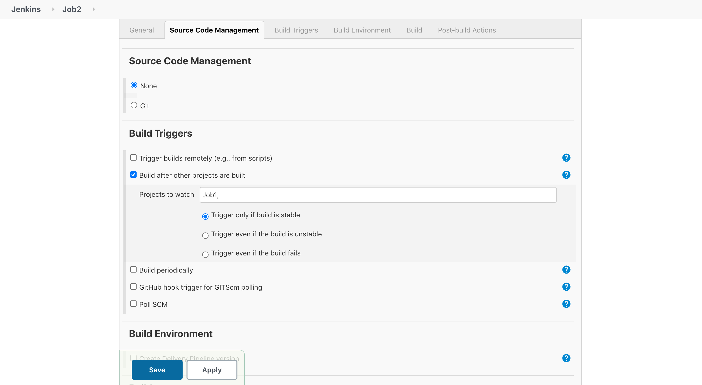
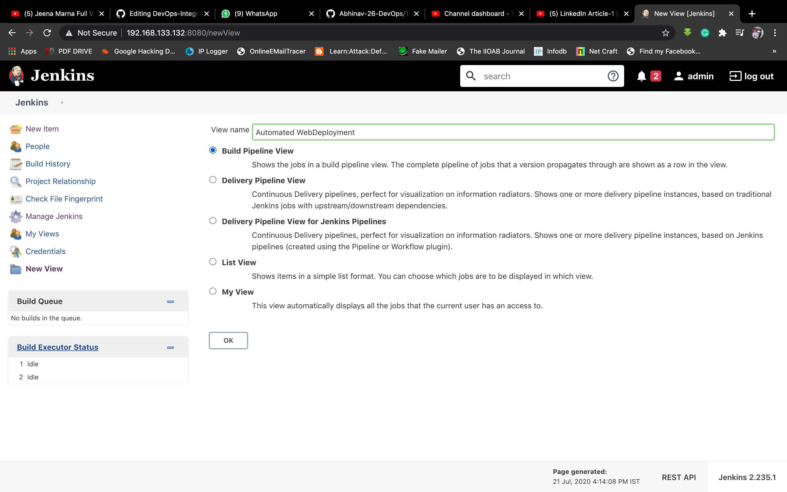
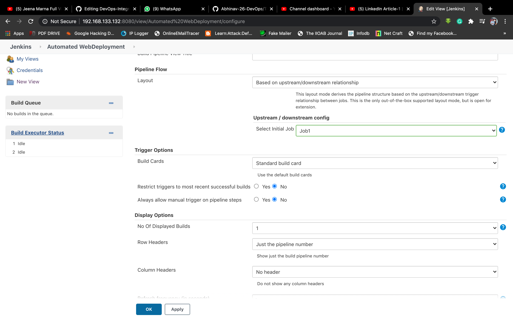

# Automated WebSite Deployment using Docker

## Overview

This project utilizes Git/GitHub, Jenkins, and Docker to establish an automated system for continuous deployment. Developed by Abdul Nadeem, this project streamlines the process of code deployment through integration with Git/GitHub repositories. The workflow is orchestrated by Jenkins, and Docker is employed to containerize the web application.

## Project Workflow

### 1. Code Commitment

When a developer commits code changes, the code is automatically pushed to the associated GitHub repository.

### 2. GitHub WebHooks

GitHub WebHooks trigger the Jenkins workspace, initiating the automated deployment process.

### 3. Jenkins Jobs

A set of Jenkins Jobs is configured to manage the deployment pipeline:

- **Job-1:** Copies the code received from GitHub to the specified workspace/folder.
- **Job-2:** Launches a Docker container with the necessary specifications for deploying the website.
- **Job-3:** Tests the deployed website to ensure its proper functionality.

### 4. Build Pipeline

A build pipeline is established to link these jobs, ensuring sequential execution: Job-1 -> Job-2 -> Job-3. This creates a seamless CI/CD process.

## How to Set Up the Project

1. **Set Up Git, Jenkins, and Docker:**
   Ensure Git, Jenkins, and Docker are installed on your system. Refer to external resources or documentation for installation guidance.

2. **Configure Jenkins Jobs:**
   - In Job-1's execute shell, use the command: `sudo cp -rvf * /name_of_your_WorkspaceFolder`.
   - In Job-2's execute shell, implement Docker container management commands.
   - In Job-3's execute shell, perform a website test using curl commands.

3. **Build Triggers:**
   Configure build triggers to automate the flow from Job-1 to Job-2 and then Job-3.

4. **Build Pipeline:**
   Set up a build pipeline using the Build Pipeline Plugin to visualize and manage the CI/CD process.
 
 
 
 

## Credits

- Project Developer: Abdul Nadeem
  - GitHub: [abdulnadeem5150](https://github.com/abdulnadeem5150)

## License

This project is licensed under the MIT License, a permissive open-source license. You are free to use, modify, and distribute the code in your projects, whether they are commercial, open-source, or personal. See the [LICENSE](LICENSE.md) file for the full text of the license agreement.

